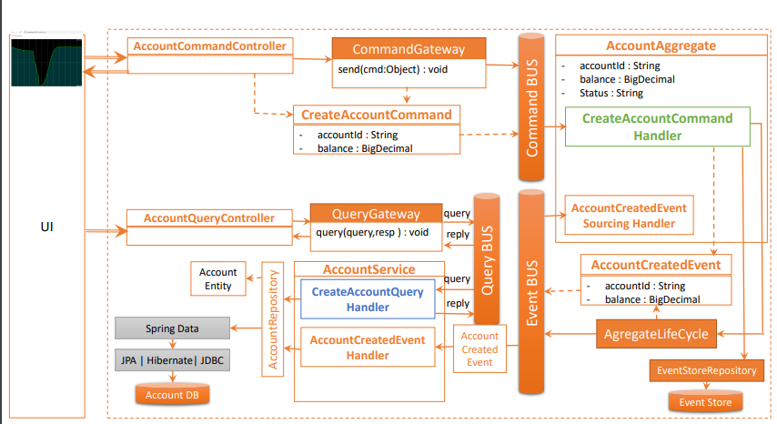
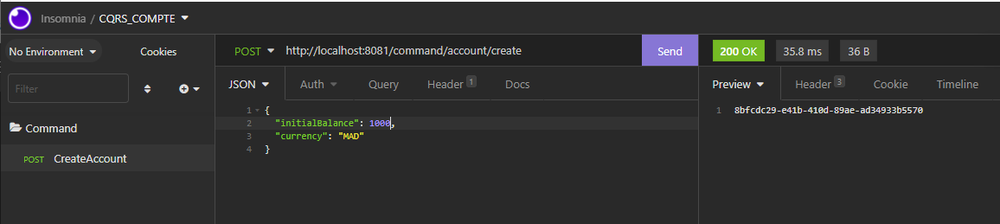
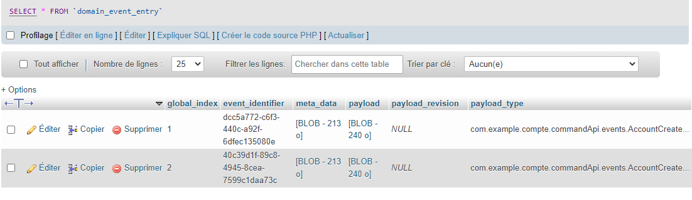
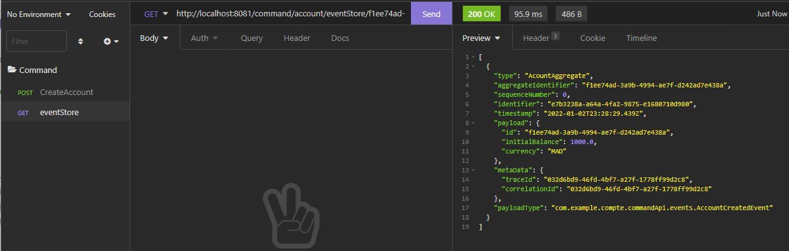

# Ibanking App Compte_CQRS-Event-Sourcing_Axon

## Application
-  une Application qui permet de gérer des comptes bancaires permet de :
    - Ajouter un Compte
    - Activer un compte après création
    - Créditer un compte 
    - Débiter un compte
    - Consulter un compte
    - Consulter les comptes
    - Consulter les opérations d’un compte
    - Suivre en temps réel l’état d’un compte
    
# Architecture du projet
-  Event Driven Micro-services Architectures, CQRS & Event Sourcing Patterns : Spring Cloud & AXON Framework

 

## Technologie est Tools
- Event Driven Micro-services Architectures
- CQRS & Event Sourcing Patterns 
- Spring Cloud & AXON Framework
- IntelliJ IDEA
- Java 8
- Maven
- Spring Boot
- Spring Boot DevTools
- Mysql database
- lombok

## Commands Side
- Creer un compte
  
  
- Consulter  BD mysql
  
  
- Consulter Event Store pour un compte
  
  
- Creer un compte
  
  
## 6) Use
Ce projet est un projet Spring boot 
- git clone repo
- configuration Databsae pour chaque microservice (application.properties)
- Run app
## 7) Sources
pour plus de détails consulter les sources suivantes
- demo video  [Event Driven Micro Services Architecture ](https://www.youtube.com/watch?v=0MG8akH6cfU)
- Spring doc  [Spring cloud  doc](https://spring.io/projects/spring-cloud)
- Axon doc  [Axon  doc](https://axoniq.io/)
### Enjoy !!
 

